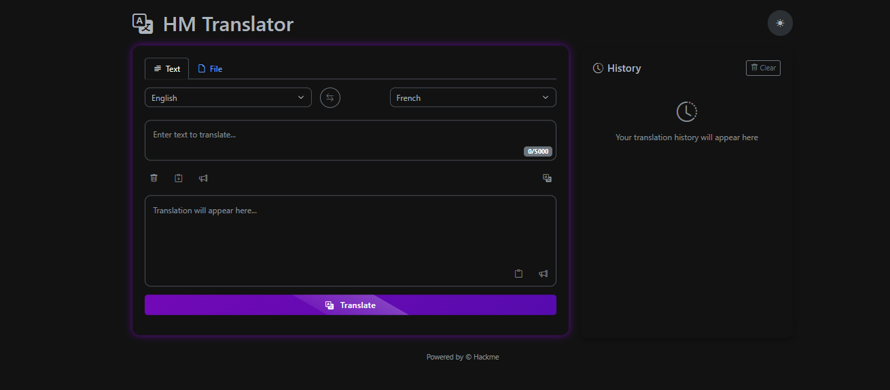
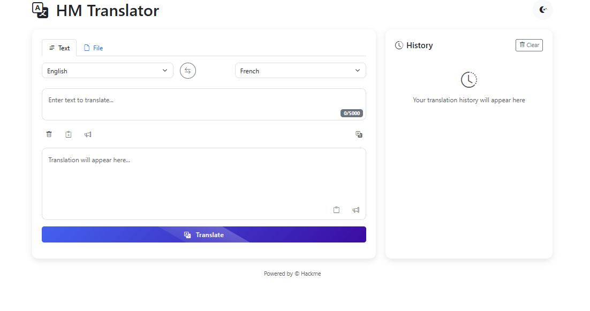

# HM-Translator
---

````markdown
# HM Translator 🌐

A sleek and powerful multilingual text and document translation web app powered by modern frontend techniques. Built with a user-friendly UI featuring neon aesthetics, dark/light theme toggle, and practical tools like clipboard access, text-to-speech, and file uploads.

## 🔧 Features

- 🌍 Language selection with automatic swap and detection
- 📝 Translate plain text or entire documents (.txt, .pdf, .docx)
- 🎙️ Text-to-speech support for both input and output
- 📋 Clipboard integration: copy, paste, and clear with one click
- 💾 Translation history with instant reuse
- 🌓 Light/Dark theme toggle with persistent preference
- 📈 Progress ring animation for better UX
- 📂 File upload for document translation
- 🎉 Toast notifications for user feedback

## 🚀 Setup Instructions

1. **Clone the repository**:
   ```bash
   git clone https://github.com/yourusername/hm-translator.git
   cd hm-translator
````

2. **Run the backend** (assuming Flask or any backend handles `/translate`):

   ```bash
   python app.py
   ```

3. **Open `index.html`** in your browser (or serve it via Flask/Express for full functionality).

> Note: Translation functionality relies on a backend `/translate` endpoint. Be sure to implement this with a translation API (e.g., NLLB, Google Translate, etc.)

## 📁 Folder Structure

```
hm-translator/
├── index.html          # Main HTML UI
├── static/             # (Optional) CSS/JS assets
├── app.py              # (Example) Backend server to handle translation
└── README.md           # This file
```

## ⚠️ Challenges Faced

### 1. **UI Responsiveness**

Ensuring the layout remained consistent across devices, especially when using Bootstrap and custom neon-styled cards, required careful tweaking.

### 2. **Theme Toggle Compatibility**

Integrating a theme toggle that seamlessly swapped styles between dark and light mode without breaking the design posed a challenge, particularly when dealing with Bootstrap's variables.

### 3. **Text-to-Speech Voice Compatibility**

Different browsers handle the `SpeechSynthesisUtterance` API differently, so ensuring consistent language output for various language codes needed mapping and fallback handling.

### 4. **File Upload Limitations**

Simulating document translation in the frontend required using `FileReader`, but parsing PDF or DOCX content without a backend processor was challenging — a real API or Python backend is needed for full functionality.

### 5. **History Management**

Adding, deleting, and dynamically reloading translation history while keeping the DOM efficient took effort, especially in handling cloned nodes and avoiding memory leaks.

### 6. **Mocking the Backend**

For demo purposes, most logic is frontend-based, so mimicking realistic backend responses like language detection and document parsing required clever UI tricks and mock delays.

---

## 🙌 Acknowledgements

* [Bootstrap 5](https://getbootstrap.com/)
* [Bootstrap Icons](https://icons.getbootstrap.com/)
* [Animate.css](https://animate.style/)
* [Web Speech API](https://developer.mozilla.org/en-US/docs/Web/API/Web_Speech_API)

---

## 📜 License

MIT License

---

> Made with ❤️ by Hackme

```

---

Let me know if you want me to customize the file for a specific backend stack (Flask, Node.js, etc.) or publish it as a downloadable `.md` file.
```
## 🌑 Dark mode

## ⚪ Light mode

